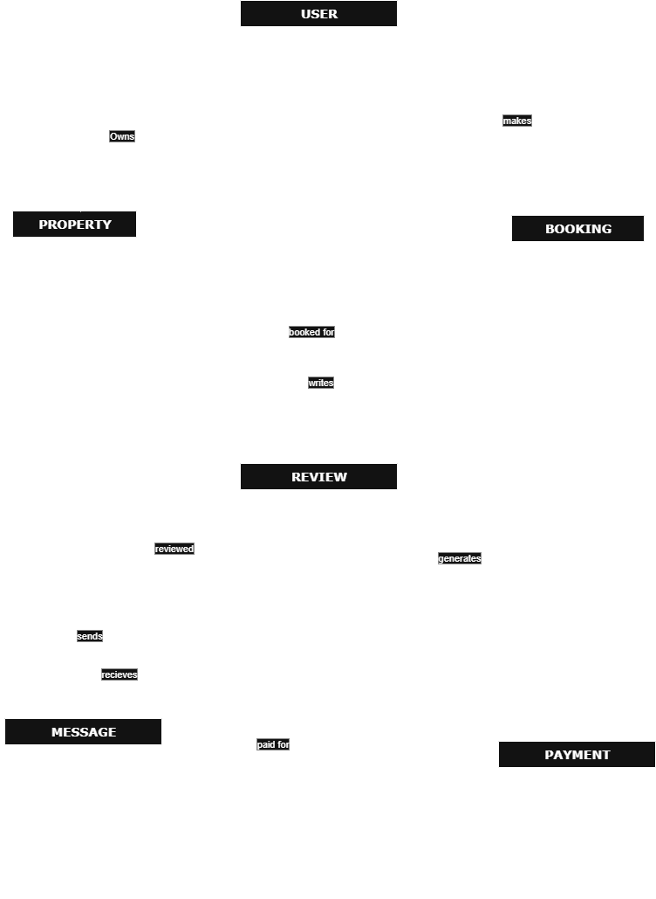

# AirBnB Database Specification

## ER Diagram

## Entities and Attributes

### User

- **user_id**: Primary Key, UUID, Indexed
- **first_name**: VARCHAR, NOT NULL
- **last_name**: VARCHAR, NOT NULL
- **email**: VARCHAR, UNIQUE, NOT NULL
- **password_hash**: VARCHAR, NOT NULL
- **phone_number**: VARCHAR, NULL
- **role**: ENUM (guest, host, admin), NOT NULL
- **created_at**: TIMESTAMP, DEFAULT CURRENT_TIMESTAMP

### Property

- **property_id**: Primary Key, UUID, Indexed
- **host_id**: Foreign Key, references User(user_id)
- **name**: VARCHAR, NOT NULL
- **description**: TEXT, NOT NULL
- **location**: VARCHAR, NOT NULL
- **pricepernight**: DECIMAL, NOT NULL
- **created_at**: TIMESTAMP, DEFAULT CURRENT_TIMESTAMP
- **updated_at**: TIMESTAMP, ON UPDATE CURRENT_TIMESTAMP

### Booking

- **booking_id**: Primary Key, UUID, Indexed
- **property_id**: Foreign Key, references Property(property_id)
- **user_id**: Foreign Key, references User(user_id)
- **start_date**: DATE, NOT NULL
- **end_date**: DATE, NOT NULL
- **total_price**: DECIMAL, NOT NULL
- **status**: ENUM (pending, confirmed, canceled), NOT NULL
- **created_at**: TIMESTAMP, DEFAULT CURRENT_TIMESTAMP

### Payment

- **payment_id**: Primary Key, UUID, Indexed
- **booking_id**: Foreign Key, references Booking(booking_id)
- **amount**: DECIMAL, NOT NULL
- **payment_date**: TIMESTAMP, DEFAULT CURRENT_TIMESTAMP
- **payment_method**: ENUM (credit_card, paypal, stripe), NOT NULL

### Review

- **review_id**: Primary Key, UUID, Indexed
- **property_id**: Foreign Key, references Property(property_id)
- **user_id**: Foreign Key, references User(user_id)
- **rating**: INTEGER, CHECK: rating >= 1 AND rating <= 5, NOT NULL
- **comment**: TEXT, NOT NULL
- **created_at**: TIMESTAMP, DEFAULT CURRENT_TIMESTAMP

### Message

- **message_id**: Primary Key, UUID, Indexed
- **sender_id**: Foreign Key, references User(user_id)
- **recipient_id**: Foreign Key, references User(user_id)
- **message_body**: TEXT, NOT NULL
- **sent_at**: TIMESTAMP, DEFAULT CURRENT_TIMESTAMP

## Relationships

- **User** owns **Property** (host_id in Property references User)
- **User** makes **Booking** (user_id in Booking references User)
- **Property** is booked via **Booking** (property_id in Booking references Property)
- **Booking** generates **Payment** (booking_id in Payment references Booking)
- **User** writes **Review** for **Property** (user_id and property_id in Review)
- **User** sends/receives **Message** (sender_id and recipient_id in Message)

## Constraints & Indexing

- Unique constraint on email in User.
- Non-null constraints on required fields.
- Foreign key constraints as described above.
- Status and rating value checks.
- Indexed primary keys and additional indexes on email, property_id, and booking_id.
